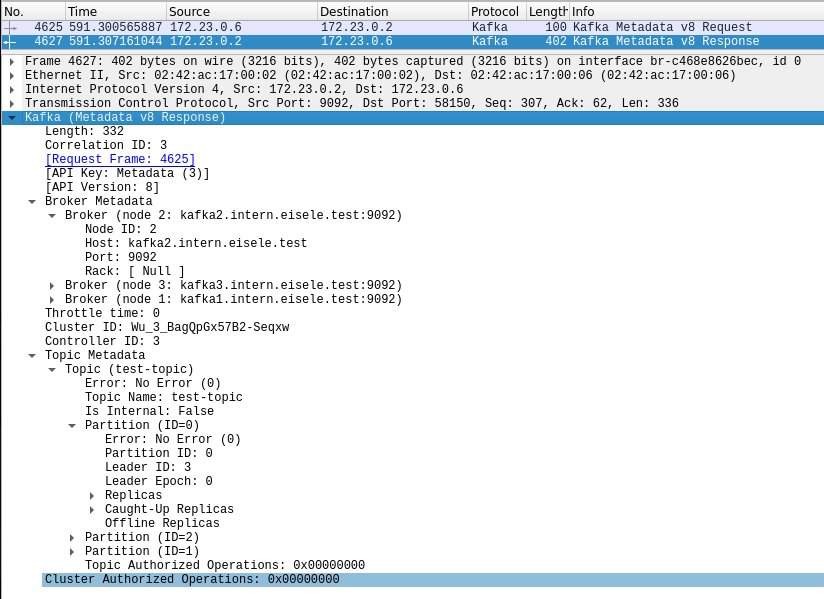

= Kafka Network

== Kafka Communication

=== Bootstrapping

== ToDo

=== Scenario

* Single Kafka network with dedicated Zookeeper network
* Distinct network for Kafka replication
** Without and with TLS
* Additional Kafka Listener on different network
** Without and with TLS
* Proxing Kafka - Enable access to Kafka from another network
** Traefik (TLS) + Kafka Proxy (Termination: Traefik, Kafka-Proxy, Kafka-Proxy und Kafka-Broker)
** Envoy (TLS) + Kafka Proxy (Termination: Envoy, Kafka-Proxy, Kafka-Proxy und Kafka-Broker)
** Traefik (TLS) + Additional Kafka Listener (Termination: Traefik, Kafka-Broker)
** Envoy (TLS) + Additional Kafka Listener (Termination: Envoy, Kafka-Broker)
* Proxing Schema Registy - Enable access to Kafka from another network
** Traefik (TLS)
** Envoy (TLS)
* Kafka Rest Proxy
** As dedicated proxy (one per customer)
** Proxy Kafka Proxy with Envoy or Traefik
* Tracing Kafka
** Tracing requests with Envoy proxy (TLS)
** Client Monitoring with Kafka 2.4 (https://cwiki.apache.org/confluence/display/KAFKA/KIP-511%3A+Collect+and+Expose+Client%27s+Name+and+Version+in+the+Brokers)

In the first stept, these scenarios are created using Docker-Compose.
In following steps, these scenarios can also be created on AWS cloud. There are additional scnerios feasable, like for example NLB TLS termination.

Additional Scenarios:

* TLS Termination at NLB (in AWS)
* mTLS for Authentication (NLB, Traefik and Envoy, Kafka-Proxy, Kafka-Broker)
* Performance Impact Tests (Cloud Setup)
** Kafka and TLS/mTLS (Instance Types (CPUs with AES-NI), Java 11)
** Kafka and mTLS
** Proxies (Traefik, NLB, Kafka-Proxy)

=== Network Simulation or Emulation Tools

* http://mininet.org/
* https://containernet.github.io/